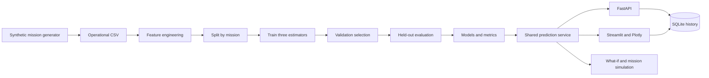

# Architecture

The API and dashboard use the same validated operating-state schema and prediction service. The dashboard calls the service directly, avoiding an unnecessary server dependency for local demonstrations. Both persist to the configured SQLite database. Writes use short-lived transactions, parameterized queries, WAL mode, and a 10-second lock timeout. SQLite history includes full input and output JSON and model version for reproducibility; it is a local prototype store, not a fleet-scale telemetry database.

Training is separate from serving. Model artifacts contain fitted preprocessing, all three estimators, and the evaluation/provenance report. A deterministic dataset hash plus scikit-learn version identifies the model bundle. API startup loads artifacts once; absent artifacts produce an actionable 503 response. No retraining endpoint is exposed.

The model target is power, not distance, so industrial work at zero travel speed is representable. Prediction converts power into reserve-aware available operating time, effective-speed range, mission energy, and shortfall. Scenario comparisons reuse this calculation. Simulation chains prescribed operating states while carrying SOC; battery capacity, SOH, and reserve cannot change mid-mission.

Operational boundaries: local single-user service, trusted model files, no authentication, no cloud deployment, no hardware connectivity, and no physical control. A future real-data system would need data governance, authentication, monitoring, independently validated horizons, and deployment-specific reliability work.
